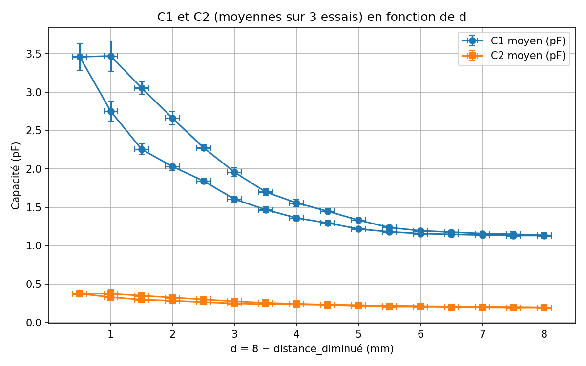

<div align="center">

# 🦾 Capteurs capacitifs imprimés en 3D pour orthèses d'exosquelette

### Capteurs de pression et de position par mesure capacitive en impression 3D multi-matériaux

[](https://www.python.org/downloads/)
[](https://platformio.org/)
[](#)
[](LICENSE)
[](https://team.inria.fr/rainbow/)

*Stage de recherche L1 MPCI · Inria / IRISA, équipe Rainbow (Rennes) · Juin–Juillet 2026*

**🇫🇷 Français** · [🇬🇧 English](README.en.md)



*Le résultat central du stage : pour un même écartement d, la capacité mesurée diffère
selon que la mousse diélectrique est en compression ou en relâchement — une hystérésis
interprétée comme une permittivité dépendante de l'histoire de la déformation.*

</div>

---

## 🎯 Contexte

Les exosquelettes d'assistance du membre supérieur estiment l'intention de mouvement
de l'utilisateur via des **capteurs de force 3 axes** — précis, mais lourds, encombrants
et coûteux. Ce stage explore une alternative : **intégrer des capteurs capacitifs
directement dans les orthèses** (les interfaces physiques humain–machine), fabriqués
en une seule étape par **impression 3D multi-matériaux** — matériau conducteur
(EEL 90A) pour les électrodes, élastomère souple (Filaflex 70A) pour les zones
déformables, TPU 95A pour la structure.

> 🔬 **Question** — Peut-on mesurer une pression (et sa position) avec des cellules
> capacitives imprimées, de façon suffisamment fiable pour instrumenter une orthèse ?

Le travail s'appuie sur les travaux de l'équipe Rainbow sur l'exosquelette du membre
supérieur et sur les capteurs capacitifs imprimés [1–4].

## ⚙️ Principe de mesure

Un condensateur plan suit `C = εS/d`. Pour s'affranchir de `ε` et `S`, mal connus,
on mesure **deux cellules en différentiel** séparées d'un décalage connu `Δd` :

```
d = Δd / (C1/C2 − 1)
```

Quand les électrodes sont superposées (V3), les permittivités diffèrent et le modèle
est étendu avec `α = ε1/ε2`, estimé par une calibration au repos. La chaîne de mesure :
puce **FDC1004** (mesure capacitive, blindage actif SHLD) → **M5Stack Core (ESP32)**
programmé en C++ via PlatformIO → visualisation Teleplot (résolution ±0,001 pF).

## 🔁 Démarche itérative

| Version | Conception | Enseignement |
|---|---|---|
| **V1** — cellules côte à côte | preuve de concept, mousse gyroïde | trop sensible à la position du doigt |
| **V2** — blindage | shield masse + blindage actif SHLD | perturbations environnementales fortement réduites |
| **V3** — électrodes superposées | même déformation pour les 2 cellules | nécessite le modèle à deux permittivités (α) |
| **V4** — capteur de position | électrodes triangulaires complémentaires | position via `x = L·C1/(C1+C2)`, ratio borné → calibration affine |
| **V5** — pilier / support soluble | variantes mécaniques | ouverture |

## 📊 Résultats clés

- **Hystérésis du diélectrique** mise en évidence et interprétée : la permittivité
  effective de la mousse est une **variable d'état** `ε(H)` dépendant de l'histoire de
  compression — le modèle géométrique bijectif `C = εS/d` ne suffit plus.
- **Identification de modèle** par moindres carrés (`scipy.optimize.least_squares`) :
  la forme `C(d) = A/(d+B) + C_b` ajuste les mesures, chaque paramètre ayant une
  interprétation physique (offset de contact, capacité de bord, εS).
- La grandeur `1/C2 − 1/C1`, prédite constante, est en réalité **linéaire en d
  (R² ≈ 0,95)** et moins hystérétique : c'est la compression du support « rigide » qui
  porte le signal → piste d'un **capteur à diélectrique solide**.
- **Capteur à cellule unique** : une seule courbe `C(d)` ajuste charge et décharge
  (R² = 0,91), l'hystérésis restant sous l'incertitude de mesure.
- **Capteur de position** : ratio expérimental borné dans [0,4 ; 0,6] au lieu de [0, 1],
  expliqué par un modèle à capacités parasites, corrigé par calibration affine.

## 📁 Structure du dépôt

```
├── docs/report.pdf        ← rapport de stage complet
├── firmware/              ← code embarqué ESP32 (PlatformIO)
│   ├── src/               ← main.cpp + driver FDC1004 (ProtoCentral, MIT)
│   └── variants/          ← versions pression simple / position / calibration affine
├── analysis/              ← scripts Python : fits moindres carrés, hystérésis,
│                            reconstruction de d, incertitudes
├── data/                  ← mesures du banc de test (CSV/XLSX) + acquisitions Teleplot
├── cad/                   ← modèles Fusion 360 + STL/3MF des 5 versions de prototypes
└── figures/               ← rendus CAO et figures de résultats (régénérables)
```

## 🚀 Prise en main

**Analyse (Python)** :
```bash
pip install -r requirements.txt
cd analysis
python ajustement_C1_modeles_bord_sans_offset_en_d.py   # fits C1 avec/sans effets de bord
python mesure_capacites_inverse_et_rapport.py           # linéarité de 1/C2 − 1/C1
python Retrouver_d.py                                   # reconstruction de d
```
Les figures sont écrites dans `figures/analysis/`.

**Firmware (ESP32 / M5Stack)** : ouvrir `firmware/` avec [PlatformIO](https://platformio.org/)
(`pio run -t upload`). Voir `firmware/variants/README.md` pour les autres versions.

## 👤 Auteur

**Lucas Chabert** — L1 MPCI, Aix-Marseille Université.
Stage encadré par **Maxime Manzano**, Inria/IRISA, équipe Rainbow (Rennes).

## 📚 Références

1. Aguilar-Segovia, J. E. (2026). *Additive Manufacturing of Deformable Sensing Devices for Human–Machine Interaction…* Thèse, INSA Rennes. [HAL](https://theses.hal.science/tel-05587063v1)
2. Aguilar-Segovia et al. (2024). *Multi-material torque sensor embedding one-shot 3D-printed deformable capacitive structures.* IEEE Sensors Letters 8(9). [HAL](https://hal.science/hal-04699911v1)
3. Manzano et al. (2025). *Enhancing the Usability of Upper-Limb Assistive Robots with a Variable Admittance Controller.* IFRATH 2025. [HAL](https://hal.science/hal-05356901)
4. Manzano et al. (2024). *Force-Triggered Control Design for User Intent-Driven Assistive Upper-Limb Robots.* IEEE/RSJ IROS 2024. [HAL](https://hal.science/hal-04774539v1)

---

<div align="center">

**📄 [Rapport complet (PDF)](docs/report.pdf)** 

</div>
